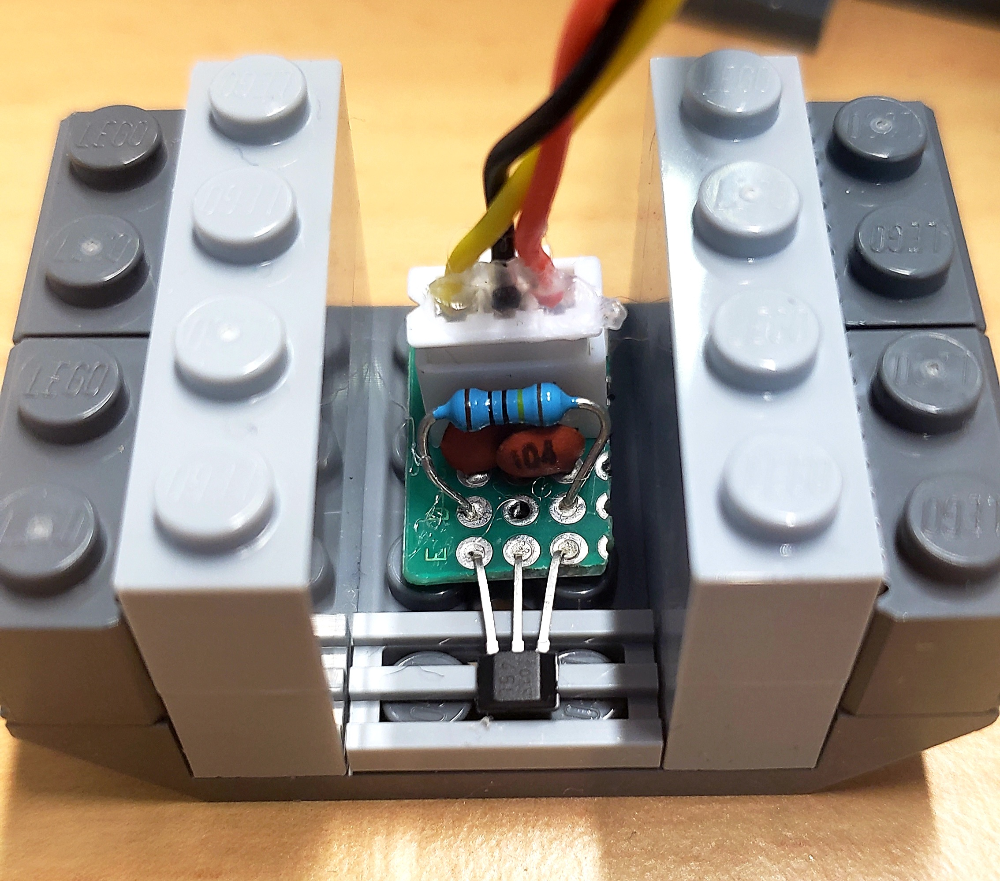
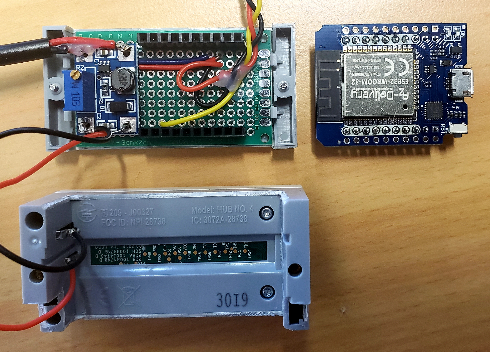
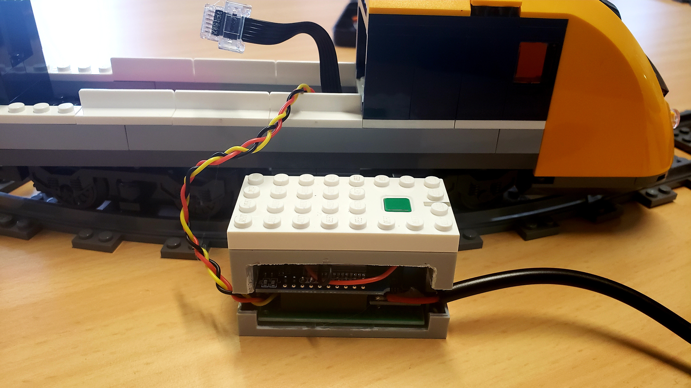
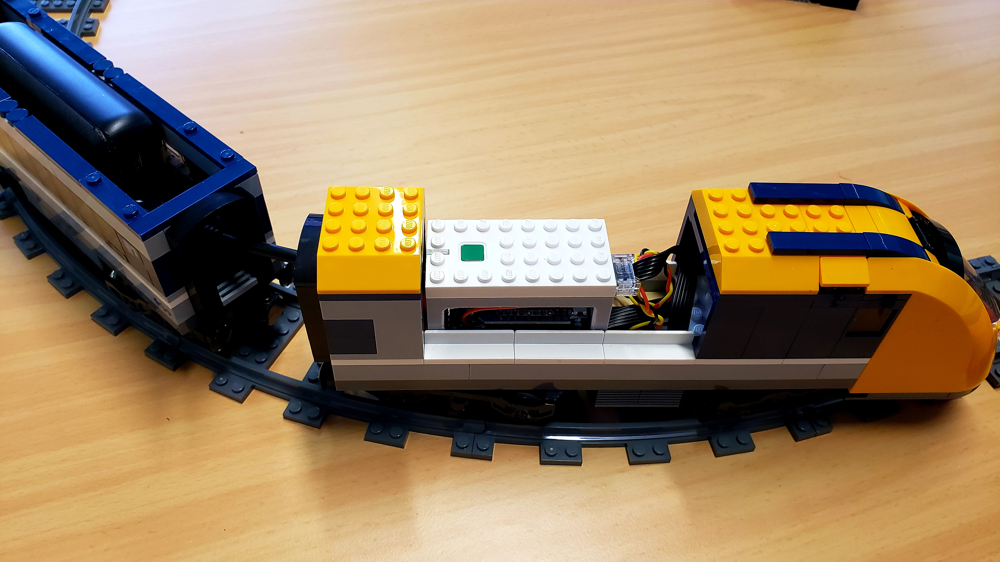
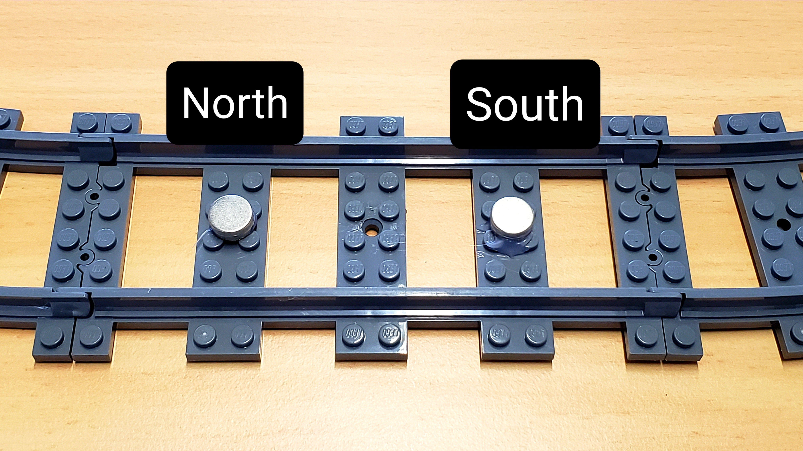

# &nbsp; SmartTrain[](https://www.fiware.org/)<br/>

[](https://github.com/FIWARE/catalogue/blob/master/iot-agents/README.md)
[](https://opensource.org/licenses/MIT)
[](https://stackoverflow.com/questions/tagged/fiware)

The SmartTrain is a device created to be implemented in the Fiware Lego Model SmartWorld. In this repository you will find the sourcecode behind it, along with the information on how to build one yourself. <br>
The code was written in C++ using PlatformIO.

## Capabilities:
The core component of the smarttrain is the D1 Mini esp32 board, which uses Bluetooth to control the PoweredUp LEGO Hub and WiFi to connect to the context broker using MQTT. 
The train is equipped with a bipolar hall sensor that is used to get the location of the train by counting how many times it passed magnets placed around the tracks.

## Materials:
- Lego Train 60197
- ESP32 D1 Mini
- SX1308 DC-DC Stepup-Module
- 2 $\cdot$ 0.1uF - (104) Ceramic Capacitor
- 1MΩ Resistor
- Hall Effect Sensor TLE4945L HALA1


## Assemble:
### Sensor module:
Here is the diagramm of the circuit. I used a powerbank as a PowerSource, but you can use anything, as long as it is 5V.<br>

<br>
The hall sensor should look something like this:<br>

<br>

### Control module module:
And the control module should look like this:<br>
<p float="left">

 
</p>
I removed the two lateral walls, and carved to holes on the other two in order to make space for the cables to pass. <br>

When assembled the train looks like this: <br>


### Track magnets: 
The magnets are used to determine the approximate location of the train. <br>
I used a bipolar sensor instead of an unipolar one, becase the later is not fast enough to react when the train is moving at 40% speed. <br>
In order to make the sensor work we need two pairs of magnets, with alternating polarities. One sets the sensor to HIGH, and the other sets it back to LOW.


## Dependencies:
[`Legoino`](https://github.com/corneliusmunz/legoino): Control the LegoHUB <br>
[`PubSubClient`](https://github.com/knolleary/pubsubclient): Connect to the Orion-LD context broker <br>
[`ArduinoJson`](https://github.com/bblanchon/ArduinoJson): Format the payloads <br>

## Build and Upload the code
To handle the software part I used PlatformIO. <br>
You will need to change the WiFi name and password to make the connection possible, along with changing the MQTT topics if necessary (if you are using our `SmartWorld` as an example, then you only need to configure the WiFi). 

## Setup in the context broker:
Run the command bellow in order to create a new entity for the train. <br>
In the case of the `SmartWorld` this command is inside the `import-data.sh` script.
```shell
curl --location --request POST 'http://iot-agent:4041/iot/devices' \
--header 'fiware-service: openiot' \
--header 'fiware-servicepath: /' \
--header 'Content-Type: application/json' \
--data-raw '{
    "devices": [
        {
            "device_id": "train001",
            "entity_name": "urn:ngsi-ld:Device:train001",
            "entity_type": "Device",
            "protocol":"PDI-IoTA-JSON",
            "transport":"MQTT",
            "timezone": "Europe/Berlin",
            "attributes": [
                {
                    "object_id": "position",
                    "name": "position",
                    "type": "Number"
                },
                {
                    "object_id": "speed",
                    "name": "speed",
                    "type": "Number"
                }
            ],
            "commands":[
                {
                    "name":"setspeed",
                    "type":"command"
                }
                ],
            "static_attributes": [
                {
                    "name": "controlledAsset",
                    "type": "Relationship",
                    "value": "urn:ngsi-ld:Building:Basis"
                }
            ]
        }
    ]
}'
```

## Sending Commands:
To send commands to the train you can simply use a PATCH request with the desired speed, here we are setting the speed to 40%

```shell
curl --location --request PATCH 'http://localhost:1026/ngsi-ld/v1/entities/urn:ngsi-ld:Device:train001/attrs/speed' \
--header 'link: <http://context/ngsi-context.jsonld>; rel="http://www.w3.org/ns/json-ld#context"; type="application/ld+json' \
--header 'fiware-service: openiot' \
--header 'fiware-servicepath: /' \
--header 'Content-Type: application/json' \
--data '{ "type": "Property",  "value": 40}'
```