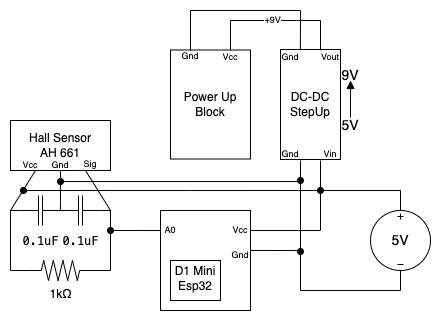

# &nbsp; SmartTrain 

The SmartTrain is a device created to be implemented in the Fiware Lego Model SmartWorld. Here in this document there is information about how the train works and how to use it.

## Materials:
- Lego Train 60197
- ESP32 D1 Mini
- SX1308 DC-DC Stepup-Module
- 2 $\times$ 0.1uF - (104) Ceramic Capacitor
- 1kΩ Resistor
- Hall Effect Sensor AH661

## Dependency:
The code depends on the library that drives the lego powerup block using bluetooth: `Legoino` 
https://github.com/corneliusmunz/legoino

## Diagram:

## API
The train is doing two things simultaneously. 
It is sending its current location and waiting for commands.

## Location:
There are magnets on the tracks. 
Based on the detection of said magnets the train is able to infer its position and send it to the Context Broker

## Commands:
To recieve commands the train listens for HTTP requests.  
The format is `http://TrainIP?<command>{value}`

### Set Speed:
GET `/s{speed}`  

Sets the speed of the train,  
speed : `int` , [-100, 100]  

example : `http://ipAddr/s/90`
___
### Set Color
GET `/c{color}`  

Sets the color of the train hub  
color : `string` : [ 
BLACK, PINK, PURBLE, 
    BLUE, LIGHTBLUE, CYAN, 
    GREEN, YELLOW, ORANGE, 
    RED, WHITE, NONE ] 

example : `http://ipAddr/cGREEN`  